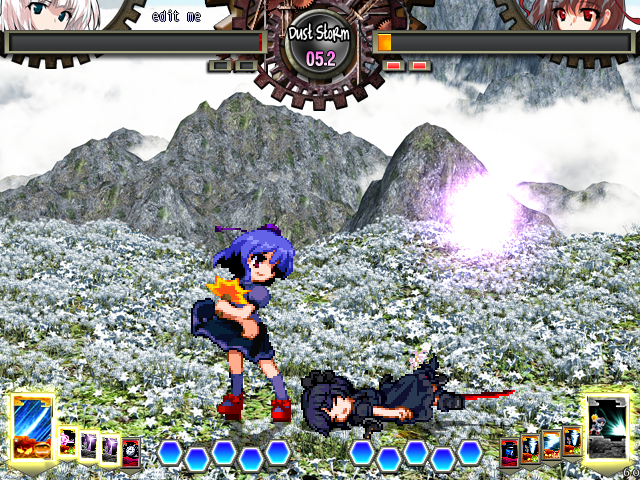
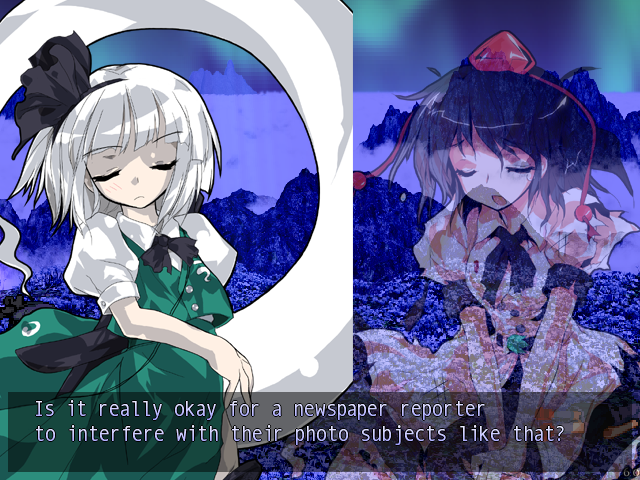

# SokuFrameExtractor

<p align="center">
  
</p>

<p align="center">
  <b>Visual game-state extraction for training game-playing AI.</b>
  <br>
  Capture what the game looks like, what the players did, and turn it into a dataset an AI can learn from.
</p>

---

## Overview

**SokuFrameExtractor** is a data collection pipeline for
[Touhou 12.3: Hisoutensoku](https://hisouten.koumakan.jp/wiki/Introduction),
designed specifically as infrastructure for training game-playing AI.

The core idea is simple:

> **Let the model learn the game from its pixels instead of handing it the game's internal state.**

The extractor runs inside the game and records gameplay frames alongside the actions taken by each player. Replay files can also be parsed to recover historical input sequences.

The resulting data can be assembled into large visual trajectories suitable for training models such as **AdaJEPA + LeWorld**, with the long-term goal of creating agents that can understand and act within the game based primarily on visual observations.

<p align="center">
  
</p>

---

## Why?

Most game-playing agents are given privileged information:

- exact player coordinates
- health values
- hitboxes
- velocities
- enemy positions
- game state variables
- deterministic simulator state

That makes learning substantially easier, but it also sidesteps an important problem:

**Can an AI actually learn how a game works from what it sees?**

SokuFrameExtractor is designed around that question.

Instead of exposing a structured game state, the dataset can contain observations like:

```text
visual observation
       │
       ▼
┌─────────────────┐
│   Game Frame    │
│   640 × 480     │
└────────┬────────┘
         │
         │ paired with
         ▼
┌─────────────────┐
│ Player Actions  │
│ movement/buttons │
└────────┬────────┘
         │
         ▼
    training data

```

Over many frames and many matches, this becomes a collection of visual trajectories:

```text
Frame t ──────► Action t ──────► Frame t+1
   │                                │
   └──────────── trajectory ────────┘

```

The objective is to provide enough data for a model to learn representations of the game world, its dynamics, and eventually useful policies.

Furthermore, this same technology could be applied to games with anti-cheats and/or games too complex to easily extract meaningful data in memory. Soku is just a test for more complex games.


----------

# Architecture

The project is split into several stages.

```text
                 Touhou Hisoutensoku
                         │
                         ▼
              ┌─────────────────────┐
              │ SokuFrameExtractor   │
              │       DLL            │
              └──────────┬──────────┘
                         │
              ┌──────────┴──────────┐
              │                     │
              ▼                     ▼
        Visual Frames          Player Inputs
          (BMP/BGRA)            (bitmasks)
              │                     │
              └──────────┬──────────┘
                         ▼
                 Per-Replay Dataset
                         │
                         ▼
                 SQLite / Data Lake
                         │
                         ▼
              Visual Learning Pipeline
                         │
                         ▼
                  AdaJEPA + LeWorld
                         │
                         ▼
                    AI Agent

```

### 1. Game instrumentation

`SokuFrameExtractor.dll` is loaded as an SWRSToys module.

It hooks into the running game and captures rendered frames while simultaneously recording the players' inputs.

### 2. Frame extraction

Frames are saved at gameplay time and associated with their corresponding frame index.

By default, frames are written as BMP images:

```text
soku_extract/
└── <replay>/
    ├── frames/
    │   ├── 000000.bmp
    │   ├── 000001.bmp
    │   ├── 000002.bmp
    │   └── ...
    └── inputs.csv

```

### 3. Action recording

Each frame records both players' controller states.

Inputs are represented as bitmasks, making the representation compact and easy to process.

### 4. Replay parsing

Existing `.rep` files can be parsed independently of live extraction.

The replay parser recovers metadata and frame-by-frame player input sequences from Hisoutensoku replay files.

### 5. Dataset construction

`build_database.py` combines extracted frames and input data into an SQLite database.

This gives downstream training code a straightforward way to query:

```sql
SELECT frame_file, p1_input
FROM frames
WHERE replay_id = 1
ORDER BY frame_index;

```

----------

# Input Representation

Each player's input state is stored as a 16-bit bitmask. 

0. `0x001` Up

1. `0x002` Down

2. `0x004` Left

3. `0x008` Right

4. `0x010` A — Melee

5. `0x020` B — Weak Bullet

6. `0x040` C — Strong Bullet

7. `0x080`D — Dash

8. `0x100`Change Card

9. `0x200` (Spell / Use Card)

Directional combinations naturally represent numpad notation:

```text
7 8 9
4 5 6
1 2 3

```

For example:

```text
8       Up
6       Right
2       Down
4       Left
9       Up + Right
1       Down + Left
5       Neutral

```

This means a single frame can be represented by a compact action vector while the model still receives the full rendered observation.

----------

# Dataset Format

A single extracted replay looks approximately like:

```text
soku_extract/
└── match_001/
    ├── frames/
    │   ├── 000000.bmp
    │   ├── 000001.bmp
    │   ├── 000002.bmp
    │   └── ...
    └── inputs.csv

```

The CSV associates each frame with the actions of both players.

The database builder converts this into a queryable SQLite dataset containing:

-   replay metadata
    
-   frame indices
    
-   frame paths
    
-   raw player input masks
    
-   individual input components
    
-   per-replay frame counts
    

This is intentionally simple: the extracted dataset should be easy to feed into whatever training pipeline comes next.

----------

# AI Training Direction

The intended downstream model is based around **AdaJEPA + LeWorld**.

Rather than training a policy directly from pixels → controller actions, the broader goal is to learn a useful representation of the game world.

A simplified conceptual pipeline is:

```text
                 Current Frame
                       │
                       ▼
                Visual Encoder
                       │
                       ▼
                 World Model
                       │
              ┌────────┴────────┐
              │                 │
              ▼                 ▼
       Representation      Predicted Future
              │                 │
              └────────┬────────┘
                       ▼
                  Action Model
                       │
                       ▼
                 Game Controller

```

The dataset therefore needs more than isolated screenshots.

**Temporal structure matters.**

A useful training sample should look like:

```text
Iₜ
 │
 ├── actionₜ
 │
 ▼
Iₜ₊₁
 │
 ├── actionₜ₊₁
 │
 ▼
Iₜ₊₂
 │
 ├── ...
 ▼
...

```

This allows the model to learn relationships such as:

-   movement
    
-   attacks
    
-   projectiles
    
-   hit reactions
    
-   animation states
    
-   character positioning
    
-   stage geometry
    
-   opponent behavior
    
-   temporal consequences of actions
    
-   transitions between game states
    

The long-term goal is to move from **"predict the next frame"** toward **"understand enough of the visual game world to make useful decisions."**

----------

# Running at Scale

One of the unusual requirements of this project is that the game is intended to run on **distributed headless Linux servers**.

The target deployment therefore looks more like a dataset-generation cluster than a traditional game setup:

```text
                       Dataset Controller
                              │
              ┌───────────────┼───────────────┐
              │               │               │
              ▼               ▼               ▼
          Linux Node 1    Linux Node 2    Linux Node 3
              │               │               │
             Wine            Wine            Wine
              │               │               │
              ▼               ▼               ▼
           Soku #1          Soku #2          Soku #3
              │               │               │
              ▼               ▼               ▼
           Frames           Frames           Frames
              │               │               │
              └───────────────┼───────────────┘
                              ▼
                       Dataset Storage

```

The important property is that the game does **not** need to be played interactively by a human.

The environment can be launched under Wine on a headless Linux machine, accelerated as much as possible, and used as a data-generation worker.

This makes it possible to scale collection horizontally:

```text
1 machine       → thousands of frames
10 machines     → tens of thousands
100 machines    → millions
N machines      → potentially enormous trajectories

```

The exact bottleneck will depend on rendering, frame extraction, encoding, storage, and the rate at which useful gameplay can be generated.

We find that the resources needed to run Soku are light enough to run on servers with as little as 1 cpu core and 2gb of ram. Just ensure you have ``multilib`` or whatever 32 bit package support your distro requires.

----------

# Fast-Forward Extraction

When extracting replay data, the normal 60 FPS limiter can be disabled.

```ini
FastForward = 1

```

This allows extraction to run as quickly as the host machine can process it rather than waiting for real-time gameplay.

That is particularly important for distributed dataset generation. Otherwise the collection time can be unreasonable.

----------

# Configuration

The extractor is configured through `SokuFrameExtractor.ini`.

Example:

```ini
[General]

OutputDir = soku_extract
ReplayDir = replay

SaveAsBMP = 1
FastForward = 1
SkipFrames = 0
Verbose = 0

EncoderThreads=4
UseRenderTarget=1

```

Important settings include:

`OutputDir` (Where extracted replay data is stored)

`ReplayDir` (Directory containing `.rep` files)

`SaveAsBMP` (Save frames as BMP images)

`FastForward` (Remove the normal frame limiter during extraction. Enable this!)

`SkipFrames` (Ignore the first N frames of each replay. There is typically a delay of 2s every match)

`Verbose` (Enable additional logging)

`EncoderThreads` (Number of encoding worker threads)

`UseRenderTarget` (Select the render-target capture path)

----------

# Building

## Requirements

The native extractor currently expects:

-   Windows-compatible C++17 toolchain
    
-   CMake 3.15+
    
-   [SokuLib](https://github.com/SokuDev/SokuLib)
    
-   DirectX 9 development libraries
    
-   SWRSToys module environment
    
-   MinGW/MSVC-compatible build environment as appropriate
    

Set the SokuLib path when configuring:

```bash
cmake -S . -B build \
  -DSOKULIB_DIR=/path/to/SokuLib

```

Then build:

```bash
cmake --build build --config Release

```

The resulting module is:

```text
SokuFrameExtractor.dll

```

Install/copy it into the appropriate SWRSToys modules directory alongside:

```text
SokuFrameExtractor.ini

```

----------

# Replay Parsing

The replay parser can recover per-frame inputs from existing `.rep` files.

Basic usage:

```bash
python scripts/soku_replay_parser.py <replay_directory>

```

Specify an output database:

```bash
python scripts/soku_replay_parser.py \
    replay/ \
    --db soku_training.db

```

Verbose logging:

```bash
python scripts/soku_replay_parser.py \
    replay/ \
    --db soku_training.db \
    --verbose

```

The parser extracts information including:

-   game version
    
-   character IDs
    
-   character names
    
-   palettes
    
-   decks
    
-   stage
    
-   music
    
-   replay file hash
    
-   frame count
    
-   per-frame player input bitmasks
    

----------

# Building the Dataset Database

Once frame extraction has produced replay directories, use:

```bash
python scripts/build_database.py soku_extract/

```

Or specify the database path:

```bash
python scripts/build_database.py \
    soku_extract/ \
    --db soku_training.db

```

Verbose output:

```bash
python scripts/build_database.py \
    soku_extract/ \
    --db soku_training.db \
    --verbose

```

The resulting SQLite database can be queried directly or used as the metadata layer for a larger training-data pipeline.

----------

# Example Queries

Get frames from a replay:

```sql
SELECT
    frame_file,
    frame_index,
    p1_input,
    p2_input
FROM frames
WHERE replay_id = 1
ORDER BY frame_index;

```

Find frames where Player 1 used melee:

```sql
SELECT
    frame_file,
    frame_index
FROM frames
WHERE p1_a = 1;

```

Count the total number of collected frames:

```sql
SELECT SUM(total_frames)
FROM replays;

```

----------

# Data Generation Strategy

The dataset is intended to grow from several complementary sources.

### 1. Human gameplay

Human replays provide naturally occurring behavior and can expose the model to:

-   neutral game
    
-   combos
    
-   defensive play
    
-   movement
    
-   mistakes
    
-   adaptation
    
-   character-specific strategies
    

### 2. Self-play

Once an initial agent exists, generated games can provide increasingly large amounts of on-policy data.

```text
Human Data
    │
    ▼
Initial Model
    │
    ▼
Self-Play
    │
    ▼
More Data
    │
    ▼
Better Model
    │
    └──────────────► Self-Play

```

### 3. Distributed environment generation

Multiple Wine instances can run simultaneously on independent Linux workers, allowing large-scale generation without requiring physical machines dedicated to playing the game.

----------

# Why Capture Pixels?

A central design goal is to avoid building an AI that only works because we gave it access to the game's internal implementation.

The desired interface is closer to:

```text
                 ┌───────────────┐
                 │     Game      │
                 └───────┬───────┘
                         │
                       pixels
                         │
                         ▼
                 ┌───────────────┐
                 │   AI Vision   │
                 └───────┬───────┘
                         │
                   representation
                         │
                         ▼
                 ┌───────────────┐
                 │ World Model / │
                 │    Policy     │
                 └───────┬───────┘
                         │
                       action
                         │
                         ▼
                 ┌───────────────┐
                 │     Game      │
                 └───────────────┘

```

This makes the project useful as more than a fighting-game bot.

The same philosophy can eventually be applied to other games and environments:

**observe → understand → predict → act.**

----------

# Project Structure

```text
SokuFrameExtractor/
├── img/
│   ├── gameplay.png
│   └── menu-movement.png
│
├── src/
│   ├── main.cpp
│   ├── frame_extractor.cpp
│   ├── frame_extractor.hpp
│   ├── video_encoder.cpp
│   ├── video_encoder.hpp
│   ├── ring_buffer.cpp
│   ├── ring_buffer.hpp
│   ├── ogl_hook.cpp
│   ├── ogl_hook.hpp
│   ├── logger.cpp
│   └── logger.hpp
│
├── scripts/
│   ├── soku_replay_parser.py
│   └── build_database.py
│
├── CMakeLists.txt
├── SokuFrameExtractor.ini
└── LICENSE

```

----------

# Current Status

The project is functional and is being developed primarily as **AI dataset infrastructure**.

The important pieces are in place:

-   Game-side frame extraction
    
-   Per-frame input capture
    
-   Replay parsing
    
-   Frame/input association
    
-   SQLite dataset construction
    
-   Fast-forward extraction
    
-   Wine/headless-oriented deployment
    
-   Large-scale distributed orchestration
    
-   Standardized training dataset format
    
-   Efficient dataset streaming
    
-   AdaJEPA + LeWorld training pipeline
    
-   Autonomous agent inference loop
    
-   Large-scale self-play
    

Some parts of the project are still... rough and may require additional work as the data-generation and model-training pipeline evolves.

----------

# Roadmap

### Dataset Infrastructure

-   Move from individual BMP files toward efficient sequence storage
    
-   Add dataset sharding
    
-   Add compression
    
-   Add dataset integrity checks
    
-   Add train/validation/test splits
    
-   Add temporal-window sampling
    
-   Add metadata indexing
    

### Environment

-   Fully automate Wine deployment
    
-   Improve headless rendering
    
-   Containerize workers
    
-   Add distributed job scheduling
    
-   Automatically collect worker statistics
    
-   Improve failure recovery
    

### Learning

-   Build AdaJEPA + LeWorld training pipeline
    
-   Learn visual representations from gameplay
    
-   Train temporal prediction/world models
    
-   Learn action-conditioned dynamics
    
-   Train an initial controller
    
-   Introduce self-play
    
-   Iterate between model improvement and environment-generated data
    

### Research

This project is largely a way for me to experiment with real-time agents for robotics. Soku just happens to be a good medium for testing at cheaper scale.

----------

# Contributing

Contributions to the extraction, replay parsing, dataset tooling, environment orchestration, and learning pipeline are welcome.

----------

# License

BSD 2-Clause License.

See `LICENSE` for the full license text.

